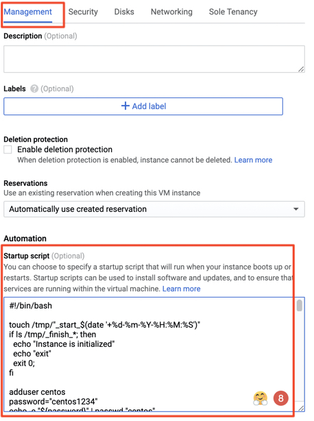
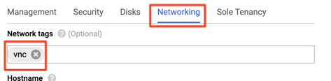

# Jarvis Remote Desktop on GCP

Jarvis Remote Desktop (JRD) is a CentOS 7 based server which is installed with the following software

- `VNC` (Virtual Network Computing) is a technology for remote desktop sharing, a form of remote access on computer networks.
- `Xfce` is a lightweight desktop environment for UNIX-like operating systems. It consumes only about 256mb memory.
- `Chrome`
- `OpenJDK 1.8.0`
- Utilities: vim htop tree wget git terminator maven

Prerequisites:

- Sign up GCP. You will need a personal credit card. You will get a USD 300 credit for a year. https://cloud.google.com/free/
- A personal GitHub account ( private repos are free now!)

## Setup Security and Firewalls

### Setup firewalls

- In GCP console, search for  `vpc firewall rules`

- Click `CREATE FIREWALL RULE`

- Configuration

  ```
  Name=vnc
  Targets=Specific target tags
  Target tags=vnc
  Source IP ranges=0.0.0.0/0
  Protocals and ports
      tcp: 5900-5910
  ```

- Click `CREATE`

## Create a remote desktop VM instance

* Menu > Comupte Engine > VM instances

* Create an instance

  ```
  Name=jrvs-remote-desktop-centos7
  Region=us-east1
  Zone=us-east1-c
  Machine type
    cores=2
    Memory=7.5
  Boot disk=centos7 SSD=32GB
  
  Check `Allow Full access to all Cloud APIs`
  Check `Allow HTTP traffic`
  Check `Allow HTTPS traffic`
  ```
  
* Click `Management, security, disks, networking, sole tenancy` 

  * Copy and paste  [start up script](./remote_desktop_init.sh) content to `Startup script` texbox
    
  
* Go to `Network tab` 

  

* Click `CREATE`

* Verify

  ```bash
  #Connect to the instance with SSH button
  ls /tmp/_*
  
  #/tmp/_start_datetime file indicate startup script start time
  #/tmp/_finish_datetime file indicate startup script finish time
  
  #If you don't see _finish_datetime file in a while..go to the troubleshooting section.
  ```

### Troubleshooting

https://cloud.google.com/compute/docs/startupscript

Use the console `ssh` button to connect to the server

```
startup script log file
CentOS and RHEL: /var/log/messages
```

## Connect to Remote Server

* Install `RealVNC` viewer on your laptop/host_machine

* Add new connection

  ```
  #find external IP by clicking the instance details
  #this external IP is not static. It will change if you stop/start the instance
  35.224.241.10:5901
  ```

* Change VNC resolution to your laptop display resolution

  ```
  xrandr --fb 1440x900
  
  alternative
  In JRD, right click anywhere on the desktop `applications` > `settings` > `display`
  ```

* Change picture quality if slow

### Troubleshooting

* 1. Check vncserver service status

  2. 1. `sudo systemctl status vncserver@:1.service`

  3. Check current running vncserver displays

  4. 1. `vncserver -list`

  5. vncserver log and config location

  6. 1. `cd ~/.vnc/` 

## Install Docker

(Optional) Change `centos` user password.

```bash
sudo su
#you can ignore `BAD PASSWORD: The password contains the ..`
#it's just a warning
#make your password simple
passwd "centos"

vim ~/accounts
#write down the password (bad practice, do not do this in production)
```

```
#go to JRD terminal
sudo su
#copy and paste docker_install.sh from GitHub GCP/ directory) to terminal
#instance will reboot 

#verify
sudo systemctl status docker
#start
sudo systemctl start docker

#sudo systemctl status|start|restart|stop docker

#run this as centos user
docker run hello-world

#shut it down to save CPU/RAM
sudo systemctl stop docker
```

## Install IntelliJ 

* In JRD, use Chrome to download `IntelliJ Community version `
  (or Ultimate version if you bring your license)

```bash
cd ~/Downloads
tar xzf ideaIC-2019.1.3.tar.gz
mkdir ~/apps
mv idea-IC-191.7479.19 ~/apps
cd ~/apps/idea-IC-191.7479.19/

#diable android and swing plugins
#install scala plugin
#Ignore `XFCE PolicyKit Agent` auth if failed

```

### Stop Instance

GCP charges running instances by minutes. 2vCPU and 7.5GB will cost you around $50-55 per month. Therefore, make sure you stop your instance every day to save costs. 

When you restart your instance next time. You will get a new external/public IP, so make sure you update your VNC connection properties. 
